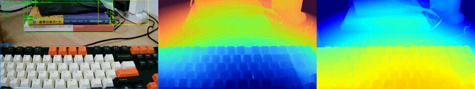
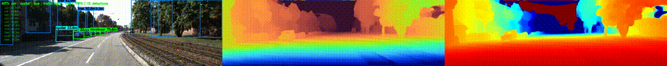

- # 基于双目立体视觉与语言驱动的实时 3D 目标感知系统

  [](assets/office_demo.mp4)
  [](assets/kitti_demo.mp4)

  基于 Fast-FoundationStereo 构建的端到端实时双目深度感知系统。

  **Demo 1（办公室场景）**：

  

  *[完整视频 (MP4)](assets/office_demo.mp4)*

  **Demo 2（KITTI 自动驾驶场景）**：

  

  *[完整视频 (MP4)](assets/kitti_demo.mp4)*

  ---

  ## 实现内容

  - 张正友双目相机标定：棋盘格角点自动检测、单目标定、双目标定、立体校正映射表生成
  - TensorRT 实时推理：基于 ONNX Runtime + TensorRT FP16，320×736 下纯推理 19ms，全管线 18-25 FPS
  - 语言驱动 3D 目标定位：Grounding DINO + FFS 深度 + LK 光流追踪，支持任意文本描述检索目标并输出米制距离
  - 支持双目相机、视频文件、图像序列和 KITTI 数据集四种输入模式

  ---

  ## 快速开始

  ### 环境配置

  ```bash
  conda create -n ffs python=3.12 && conda activate ffs
  pip install torch==2.6.0 torchvision==0.21.0 xformers --index-url https://download.pytorch.org/whl/cu124
  pip install -r requirements.txt
  pip install tensorrt-cu12 --extra-index-url https://pypi.nvidia.com
  pip install ultralytics groundingdino-py
  ```

  ### 下载模型权重

  从 [NVIDIA 网盘](https://drive.google.com/drive/folders/1HuTt7UIp7gQsMiDvJwVuWmKpvFzIIMap) 下载以下文件放入 `weights/` 目录：

  - `model_best_bp2_serialize.pth` — FFS PyTorch 权重
  - `onnx/` — 预导出 ONNX 模型（整个目录）

  ### 下载 Grounding DINO 权重

  从 [HuggingFace](https://huggingface.co/ShilongLiu/GroundingDINO/resolve/main/groundingdino_swint_ogc.pth) 下载放入 `weights/` 目录。

  ### 下载 BERT 模型

  从 [HuggingFace](https://huggingface.co/google-bert/bert-base-uncased) 下载以下文件放入 `bert-base-uncased/`：

  - `config.json`, `model.safetensors`, `tokenizer_config.json`, `vocab.txt`

  ### 双目标定

  ```bash
  # 拍摄 20-30 张不同位姿的棋盘格图放入 calibration/
  python calibration/stereo_calibrate.py \
      --calib_dir calibration/ \
      --pattern_size "8,4" \
      --square_size 0.013 \
      --output_dir calibration/calib_results/
  ```

  ### 实时深度估计

  ```bash
  # 视频文件
  python scripts/realtime_depth_trt.py --video your_video.avi --model 20_26_39 --res 320x736
  
  # 图片序列（更流畅）
  python scripts/realtime_depth_trt.py --images video_frames --model 20_26_39 --res 320x736
  
  # 保存结果视频
  python scripts/realtime_depth_trt.py --video your_video.avi --no_display --save
  ```

  ### 语言驱动 3D 目标定位

  ```bash
  # KITTI 场景
  python scripts/kitti_open_vocab.py \
      --text "car . pedestrian . cyclist . truck . traffic light"
  
  # 办公室场景
  python scripts/open_vocab_3d.py \
      --video video/office.avi.avi \
      --text "person . chair . monitor . keyboard"
  ```

  ### KITTI 数据集评估

  ```bash
  python scripts/kitti_eval.py \
      --kitti_dir path/to/KITTI/sequence \
      --model 23_36_37 --res 576x960 --iters 8
  ```

  ---

  ## 项目结构

  ```
  ├── calibration/               # 双目标定
  │   ├── stereo_calibrate.py    #   张正友标定全流程
  │   └── calib_results/         #   标定输出 (K.txt, calib_data.pkl 等)
  ├── scripts/
  │   ├── realtime_depth_trt.py  # TRT 实时深度估计
  │   ├── kitti_open_vocab.py    # KITTI 语言驱动 3D 定位
  │   ├── open_vocab_3d.py       # 办公室场景 3D 定位
  │   ├── kitti_eval.py          # KITTI LiDAR 定量评估
  │   ├── kitti_live.py          # KITTI 实时深度可视化
  │   └── realtime_recon.py      # 实时 3D 点云生成
  ├── core/                      # FFS 模型 (NVIDIA 源码)
  ├── weights/                   # 模型权重 (需下载)
  │   └── onnx/                  #   预导出 ONNX 模型
  ├── bert-base-uncased/         # BERT 词表 (需下载)
  ├── assets/                    # Demo 视频和图片
  └── docs/                      # 文档
  ```

  ---

  ## 引用

  **Fast-FoundationStereo**

  Bowen Wen, Shaurya Dewan, Stan Birchfield.  
  *Fast-FoundationStereo: Real-Time Zero-Shot Stereo Matching.* CVPR 2026.

  - 论文: <https://arxiv.org/abs/2512.11130>
  - 代码: <https://github.com/NVlabs/Fast-FoundationStereo>

  **Grounding DINO**

  Shilong Liu, Zhaoyang Zeng, Tianhe Ren, Feng Li, Hao Zhang, Jie Yang, Chunyuan Li, Jianwei Yang, Hang Su, Jun Zhu, Lei Zhang.  
  *Grounding DINO: Marrying DINO with Grounded Pre-Training for Open-Set Object Detection.* ECCV 2024.

  - 论文: <https://arxiv.org/abs/2303.05499>
  - 代码: <https://github.com/IDEA-Research/GroundingDINO>
